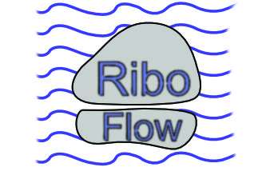

[](https://doi.org/10.5281/zenodo.3376949)



# RiboFlow

RiboFlow is a [Nextflow](https://www.nextflow.io/) pipeline for processing ribosome profiling data. It produces [ribo files](https://ribopy.readthedocs.io/en/latest/ribo_file_format.html) that can be analyzed with [RiboR](https://github.com/ribosomeprofiling/ribor) or [RiboPy](https://github.com/ribosomeprofiling/ribopy). RiboFlow is part of a [software ecosystem](https://ribosomeprofiling.github.io/) for ribosome profiling data.


## What it does

For each sample the pipeline trims adapters, removes rRNA/tRNA reads, aligns the rest, removes duplicates and writes alignment statistics. It has three parts, and you can turn each one on or off in the params file:

| Part | Turned on by | Produces |
|---|---|---|
| Genome alignment (STAR) | `genome.run: true` (default) | BAM and BED files, `stats.csv` |
| Transcriptome alignment (bowtie2) | `transcriptome.run: true` | one `.ribo` file per sample and a merged `all.ribo` |
| RNA-seq | `do_rnaseq: true` | the same for matching RNA-seq samples, added into the `.ribo` files |

## Contents

- [Quickstart](#quickstart)
- [Where to run it](#where-to-run-it)
- [Running on your data](#running-on-your-data)
- [Output](#output)
- [STAR genome index](#star-genome-index)
- [Deduplication](#deduplication)
- [Transcriptome path and .ribo files](#transcriptome-path-and-ribo-files)
- [Optional features](#optional-features)
- [Citing](#citing)
- [FAQ](FAQ.md) and [Changelog](CHANGELOG.md)

## Quickstart

These steps are for Linux (x86-64). On other systems use the Docker image (see [Where to run it](#where-to-run-it)).

**1. Install Miniconda** if you do not have `conda`: <https://docs.conda.io/en/latest/miniconda.html>. Open a new terminal afterwards.

**2. Download the pipeline.**

```bash
git clone https://github.com/ribosomeprofiling/riboflow.git
cd riboflow
```

**3. Create the environment.** This installs Nextflow and every tool the pipeline uses.

```bash
conda env create -f environment.yaml
conda activate riboflow
```

**4. Get the references and example data.** Run this inside `riboflow/`. The first repository holds the rRNA filter, transcriptome and annotation references. The second holds example FASTQs and a small prebuilt STAR genome index.

```bash
git clone https://github.com/ribosomeprofiling/references_for_riboflow.git
git clone https://github.com/ribosomeprofiling/rf_sample_data.git
```

**5. Run an example.**

```bash
nextflow run main.nf -profile default -params-file examples/example_position_multi.yaml
```

**6. Look at the results** under `position_output/`:

- `stats/genome/stats.csv`: alignment summary, one column per sample
- `alignments/`: deduplicated BAM and BED files
- `ribo/all.ribo`: the merged `.ribo` file

The other four example files run the same way. See [Running on your data](#running-on-your-data).

## Where to run it

`-profile` takes two parts: where the tools come from, and how big the machine is.

| Tools | Flag | Notes |
|---|---|---|
| Your active conda env | *(nothing)* | As in the Quickstart. Tools must be on `PATH`. |
| Conda managed by Nextflow | `conda` | Nextflow builds the env from `environment.yaml`. |
| Docker | `docker` | Uses `danielnguyener/riboflow:2.0.0`. Works on macOS and Windows. |
| Apptainer / Singularity | `apptainer` | Same image. For HPC clusters. |

| Machine | Flag | Sized for |
|---|---|---|
| Workstation | `default` | 16 cores, 64 GB RAM. Used when you give no machine flag. |
| TACC Lonestar6 | `lonestar6` | One full node, 128 cores, 256 GB RAM. |

Combine them with a comma:

```bash
nextflow run main.nf -profile docker,default   -params-file my_run.yaml   # local machine, Docker
nextflow run main.nf -profile conda,lonestar6  -params-file my_run.yaml   # HPC node, conda
```

To fit another machine, copy `conf/default.config`, change the CPU and memory values, and pass it with `-c my_machine.config`.

**On an HPC cluster with Apptainer**, pull the image once, then start the pipeline from inside it:

```bash
apptainer pull docker://danielnguyener/riboflow:2.0.0      # once
apptainer shell riboflow_2.0.0.sif
nextflow run /path/to/riboflow/main.nf -profile lonestar6 -params-file my_run.yaml
```

## Running on your data

Start from the example file closest to your experiment and edit it.

| Example | Duplicate removal | Covers |
|---|---|---|
| `examples/example_position_multi.yaml` | by position | Genome, transcriptome and RNA-seq. Several lanes per sample. |
| `examples/example_umi_uniq.yaml` | by UMI | Same, for libraries with UMIs. |
| `examples/example_transcriptome_only.yaml` | by UMI | Transcriptome only, no STAR genome alignment. |
| `examples/example_build_index.yaml` | by UMI | Builds the STAR index from a FASTA and GTF instead of using a prebuilt one. |
| `examples/example_rnaseq_pe.yaml` | none | Paired-end RNA-seq. Also keeps multi-mapping reads. |

The shipped STAR index is a small example reference. For real data point `input.reference.genome` at an index for your genome (see [STAR genome index](#star-genome-index)).

Edit these parts of the file:

1. **References**, under `input.reference`:
   - `filter`: the bowtie2 rRNA index prefix. `references_for_riboflow` includes human and mouse.
   - `genome`: a STAR index directory. Or give `genome_fasta` and `gtf` to have the pipeline build one.
   - `transcriptome`, `regions`, `transcript_lengths`: needed only when `transcriptome.run: true`.
2. **FASTQ files**, under `input.fastq`: one list of files per sample. Each file is one lane; lanes are merged after alignment.
3. **Adapter trimming**, `clip_arguments`: cutadapt options, including your adapter sequence.
4. **Duplicate removal**, `dedup_method`: `umicollapse`, `position` or `none`. See [Deduplication](#deduplication).
5. **Output folders**, `output.output.base` and `output.intermediates.base`.

Run it:

```bash
nextflow run main.nf -profile default -params-file my_run.yaml
```

Add `-resume` to rerun after changing a setting; finished steps are reused.

Settings that belong to a group, such as `genome.run`, go in the params file. Do not pass them on the command line as `--genome.run false`: Nextflow replaces the whole `genome` group with just that one key.

### Which reads are kept

After alignment each read goes through a quality filter. The defaults suit most ribosome profiling experiments and you normally do not need to change them:

```yaml
genome:
  unique_only: true                      # keep reads that map to exactly one place
  samtools_filter_arguments: "-F 2308"   # drop unmapped, secondary and supplementary records
transcriptome:
  mapping_quality_cutoff: 10             # bowtie2 confidence score; 40 or more means unique
  samtools_filter_arguments: "-F 2308"
```

`samtools_filter_arguments` accepts any `samtools view` option that selects reads (`-f`, `-F`, `-e`, `-L`, ...). Mistakes are reported before the run starts. Keeping multi-mapping reads is described under [Optional features](#keeping-multi-mapping-reads).

## Output

Paths below use `<out>` and `<inter>` for the two folders set in the params file. RNA-seq results are under `<out>/rnaseq/`. Folders marked optional appear only when the matching setting is on.

```
<out>/
├── alignments/ribo/
│   ├── individual/                      # per lane
│   │   ├── <sample>.<lane>.genome.post_dedup.bed
│   │   └── <sample>.<lane>.post_dedup.bam (+ .bai)     # umicollapse only
│   ├── merged/                          # per sample
│   │   ├── <sample>.dedup.bam (+ .bai)  # <sample>.post_dedup.bam with position dedup
│   │   └── <sample>.genome.post_dedup.bed
│   └── stranded/                        # optional: do_strand_split
├── bigwigs/ribo/                        # optional: do_bigwig
├── fastqc/                              # optional: do_fastqc
├── ribo/                                # transcriptome.run
│   ├── <sample>.ribo
│   └── all.ribo
├── rnaseq/                              # do_rnaseq: same layout for RNA-seq
└── stats/
    ├── genome/stats.csv                 # one column per sample
    ├── genome/individual_stats.csv      # one column per lane
    ├── transcriptome/...                # transcriptome.run
    └── index_fastq_correspondence.txt   # which FASTQ became which sample.lane
```

`stats.csv` reports read counts at each step: total, after trimming, after the rRNA filter, aligned once, aligned to several places, unaligned, after the quality filter and after duplicate removal.

`<inter>/` holds everything in between: trimmed FASTQs, rRNA filter BAMs, STAR and bowtie2 BAMs and logs, quality-filtered BAMs and BEDs. They are kept so you can look at the reads at any step. The folder can be deleted; a rerun recreates what it needs.

Lane numbers come from the order of the files in the params file. If you reorder or add FASTQs for a sample, delete that sample's intermediates first, otherwise files from the old order are reused.

## STAR genome index

Give either a prebuilt index or the files to build one, not both.

**Prebuilt index:**

```yaml
input:
  reference:
    genome: /path/to/STAR_index     # folder with SA, SAindex, Genome, chrNameLength.txt
```

Build it with the STAR version in `environment.yaml`:

```bash
STAR --runMode genomeGenerate --runThreadN 16 \
  --genomeDir /path/to/STAR_index \
  --genomeFastaFiles genome.fa --sjdbGTFfile annotation.gtf \
  --sjdbOverhang 28
```

**Built by the pipeline:**

```yaml
input:
  reference:
    genome_fasta: /path/to/genome.fa
    gtf:          /path/to/annotation.gtf
star:
  sjdb_overhang: 28            # longest read length minus 1
  index_dir: /path/to/cache    # the built index is saved here and reused by later runs
```

Use `sjdb_overhang: 28` for ribosome profiling (footprints are about 26 to 34 nt after trimming). The default, 100, suits full-length RNA-seq reads. `examples/example_build_index.yaml` shows this mode.

## Deduplication

| `dedup_method` | What it does |
|---|---|
| `umicollapse` | Uses UMIs. Needs `umi_tools_extract_arguments` to say where the UMI sits in the read. |
| `position` | Treats reads with the same position, length and strand as duplicates. For libraries without UMIs. |
| `none` | No duplicate removal. |

```yaml
dedup_method: "umicollapse"
# 12 nt UMI at the 5' end followed by 4 nt to discard
umi_tools_extract_arguments: "-p \"^(?P<umi_1>.{12})(?P<discard_1>.{4}).+$\" --extract-method=regex"
```

RNA-seq has its own setting, `rnaseq.dedup_method`, with the same choices.

## Transcriptome path and .ribo files

With `transcriptome.run: true` reads are aligned to the transcriptome with bowtie2, filtered and deduplicated, and `ribopy create` writes one `.ribo` file per sample. `ribopy merge` combines them into `all.ribo`. This needs the `transcriptome`, `regions` and `transcript_lengths` references and the `ribo` settings (`ref_name`, `metagene_radius`, `left_span`, `right_span`, `read_length`).

Only transcriptome alignments go into `.ribo` files. Genome alignment results stay as BAM, BED and `stats.csv` files.

## Optional features

Everything here is off by default.

### RNA-seq

Set `do_rnaseq: true` and list FASTQs under `rnaseq.fastq` using the same sample names as the ribo-seq data. RNA-seq is trimmed, filtered, aligned and deduplicated on its own, with results under `<out>/rnaseq/`. When `transcriptome.run` is on, the RNA-seq counts are added to each sample's `.ribo` file.

### Paired-end RNA-seq

Give a lane as a pair of files, `[R1, R2]`. Paired-end works for the genome alignment with `rnaseq.dedup_method` `none` or `umicollapse`; `position` and the transcriptome path do not support paired-end and stop the run with a message. Counts in `stats.csv` are per fragment, not per mate.

For paired-end data add `-f 2` to `rnaseq.genome.samtools_filter_arguments` to keep only properly paired reads. Do not use `-f 2` for single-end data; it would remove every read.

A pair is removed by the rRNA filter only when both mates align to it together. See `examples/example_rnaseq_pe.yaml`.

### Keeping multi-mapping reads

By default only reads that align to exactly one place are kept (`unique_only: true`). To keep multi-mapping reads:

```yaml
genome:
  unique_only: false
  mapping_quality_cutoff: 0              # minimum MAPQ; 0 keeps everything
  samtools_filter_arguments: "-F 2052"   # keep secondary alignments too
```

`stats.csv` then adds rows splitting the kept reads into unique, multi-mapping and secondary alignments. How those rows are counted can be changed with `samtools_count_arguments`; the defaults are commented in the example files and are right for STAR.

`rnaseq.genome` has the same settings for RNA-seq.

### Metadata in .ribo files

```yaml
ribo:
  ribometa: ./my_run.yaml          # one file describing the whole experiment
  metadata:
    base: ./meta
    files:
      GSM1606107: GSM1606107.yaml  # one file per sample; names must match input.fastq
```

Examples are in `meta/`. Check what was stored with `ribopy meta info <out>/ribo/<sample>.ribo`.

### Other settings

| Setting | Effect |
|---|---|
| `do_strand_split` | Splits each final ribo-seq BAM into plus and minus strand BAM and BED files. |
| `do_bigwig` | Writes strand-specific bigWig coverage tracks. Slow. |
| `do_fastqc` | Runs FastQC on the raw, trimmed, aligned and unaligned reads. |
| `do_check_file_existence` | Checks that every input path exists before starting. On in all examples. |
| `star.output_transcriptome_bam` | STAR also writes a BAM in transcriptome coordinates, deduplicated into `<inter>/star_transcriptome/`, for tools such as Salmon. |

## Citing

[RiboFlow, RiboR and RiboPy: an ecosystem for analyzing ribosome profiling data at read
length resolution, H. Ozadam, M. Geng, C. Cenik, *Bioinformatics* 36 (9),
2929-2931](https://academic.oup.com/bioinformatics/article/36/9/2929/5701654)

```bibtex
@article{ozadam2020riboflow,
  title={RiboFlow, RiboR and RiboPy: an ecosystem for analyzing ribosome profiling data at read length resolution},
  author={Ozadam, Hakan and Geng, Michael and Cenik, Can},
  journal={Bioinformatics},
  volume={36},
  number={9},
  pages={2929--2931},
  year={2020},
  publisher={Oxford University Press}
}
```

## [FAQ](FAQ.md) and [Changelog](CHANGELOG.md)
